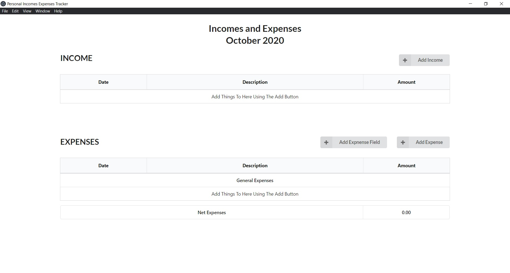
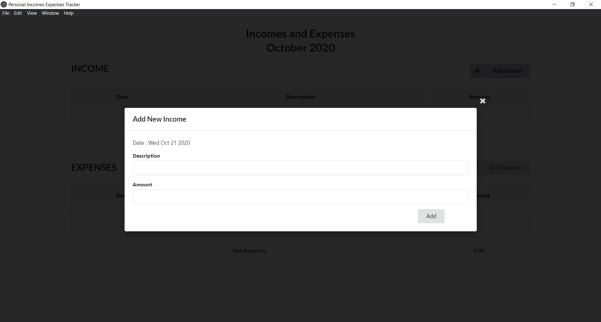
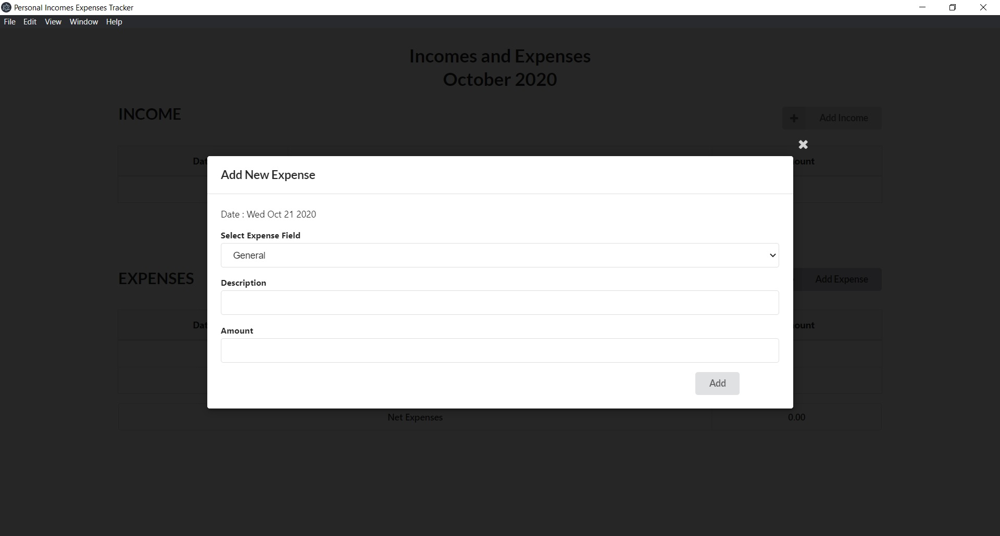
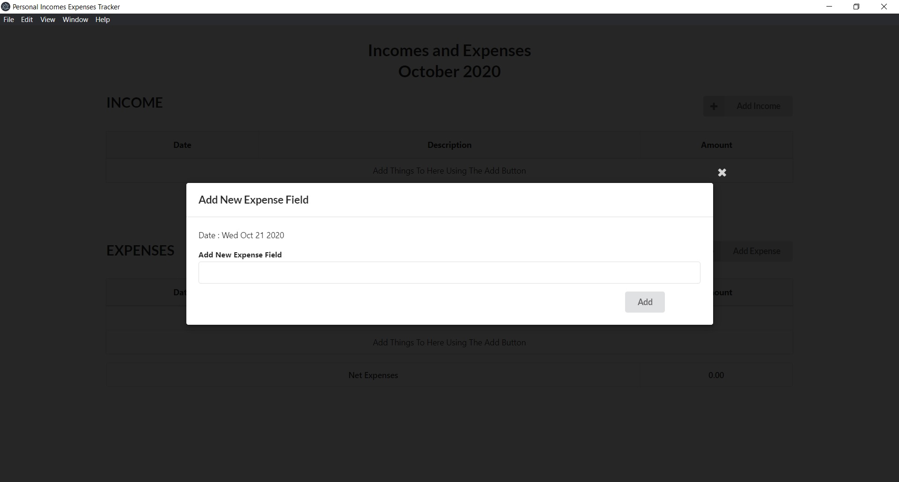
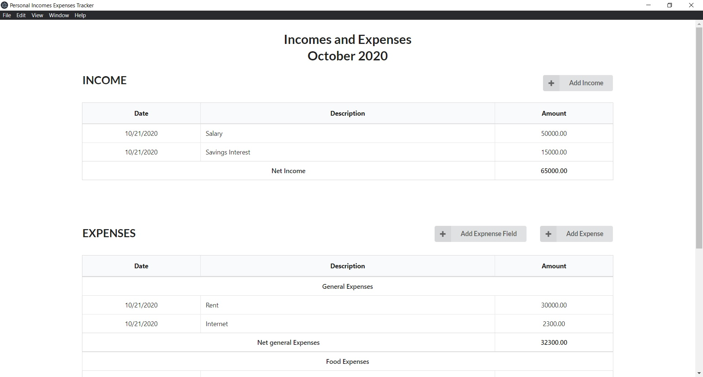
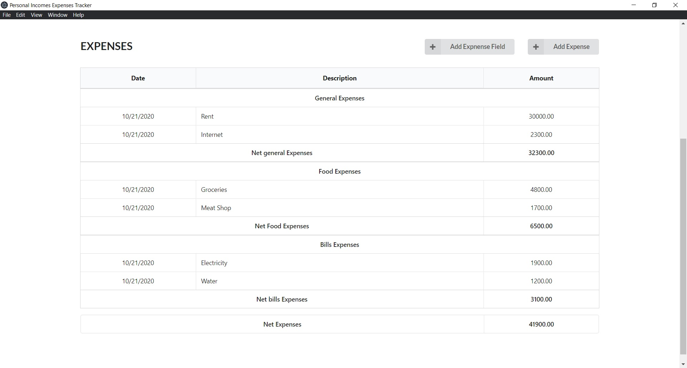

# Windows Desktop app to manage incomes and expenses for the month

## features
* Keep track of incomes and expenses
* Divide expenses to fields

[Download Setup file](https://drive.google.com/file/d/1bqpnSqZ1FJW5-worYd-wBEU7f5hmunNM/view?usp=sharing)

